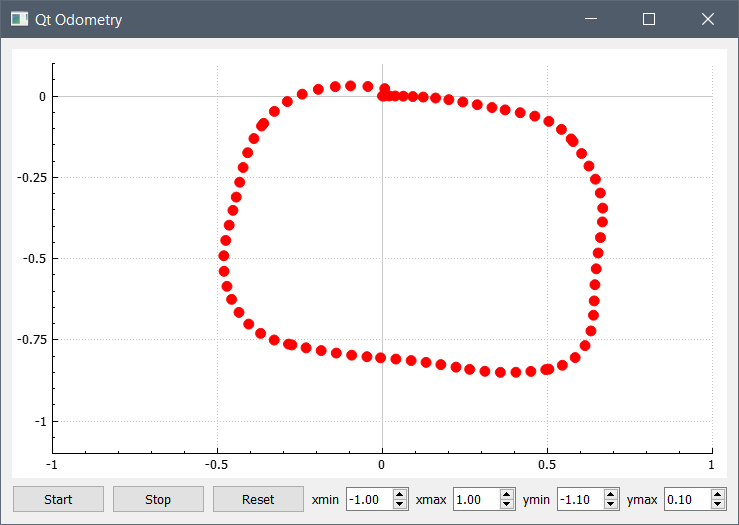

# qt-odometry
## About

A simple Qt interface for plotting the position of a unicycle robot fitted with incremental encoder.

The distances traveled by both wheels are computed by a microcontroller, then are sent, at regular intervals, to the computer via the serial interface.

When the distances are received, the robot's pose is computed based on a basic kinematics model, then it is plotted on a frame centered around the initial pose of the robot.

This application can be seen in action in this [video](https://www.youtube.com/watch?v=qXxMXaPvj-s) (1:56 to 2:17).

## Build

This project has been successfully built using : 

- Qt 5.15.1
- CMake 3.19.5 (make file included)
- QCustomPlot 2.1.0 (source files are not included, must be downloaded from this [link](https://www.qcustomplot.com/index.php/download)).

## Screenshot

